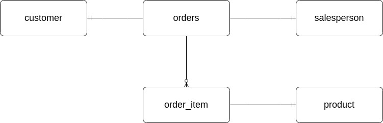

# Introduction
This application is used to interact with a Postgres database through the use of Docker and Java Database Connectivity (JDBC).
It has CRUD (Create, Read, Update, Delete) operations defined within the Data Access Object class to interact with the data
and retrieve a result set of queries from the database. The technologies used within the project are JDBC, Maven, PSQL, Docker,
DAO, and DTO.
<!--- test-->

# Implementation
This section explains the entity relationship of the hplussport database and the design patterns to be used within the project.
## ER Diagram
This entity-relationship diagram represents the relationship between the entities of the hplussport database used within the JDBC application. 


## Design Patterns
A major difference of the DAO and Repository design pattern is that the repository design pattern 
focuses purely on single-table access per class. In the repository pattern, SQL joins are done in the code instead of the database. 
The repository design pattern also allows for sharding of the database. Sharding is the process of separating specific data from the
database as a horizontal partition of data. The repository design pattern fits better for horizontally scalable while the DAO pattern is used when the application is more vertically
scalable. The DAO pattern is an abstraction of data persistence while the repository pattern is an abstraction of a collection of objects.

To summarize, both the DAO and Repository patterns are a way of implementing the data access layer in an application and can be selected based on the constraints of the application.
The best design pattern is situational based on which layer your constraints are in and the purpose of the application.

# Test
The application was tested against the database by changing the main method within the JDBCExecutor to create 
a new instance of the desired DAO, relation-object - such as OrderDAO, Order, OrderLine - and calling the method
to be tested, then printing the result set. The result set would then be manually compared to the records retrieved from
the psql command line and verified that the JDBC SQL query retrieved the correct result.\
All test data was imported by using the -f flag within the psql command line call, the data was generated and inserted to the 
database within the .sql files retrieved from the Exercise Files of the Lynda learning course.
```bash
#Data Setup
#Create database:
psql -h localhost -U postgres -f database.sql

#Insert test customer data into customer table
psql -h localhost -U postgres -d hplussport -f customer.sql
#Insert test product data into product table
psql -h localhost -U postgres -d hplussport -f product.sql
#Insert test salesperson data into salesperson table
psql -h localhost -U postgres -d hplussport -f salesperson.sql
#Insert test orders data into orders table
psql -h localhost -U postgres -d hplussport -f orders.sql
```