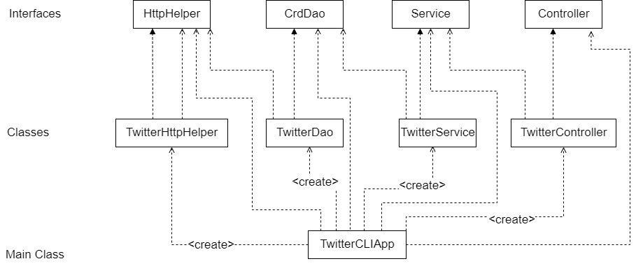

# Introduction
This app is used to create, read, and delete existing Tweets through the use of the Twitter REST API. 
The technologies used within the project are Maven, HTTP client, Docker, Twitter REST API, and Java libraries.
This application allows for the users to create new tweets by specifying the status and coordinates (latitude:longitude) or search
existing tweets by their ID, or delete multiple tweets by specifying an array of IDs. The retrieved tweets are then displayed in a 
JSON format to the console. The tweet is posted to the Twitter account via the use of OAuth 1 tokens. 

# Quick Start
The mvn command allowed for the project to generate the JAR files, clean the project, and copies
corresponding dependencies from the remote Maven repo to the local Maven repository. The app was cleaned and packaged using 
Maven by using the following command: ```mvn clean package```

The application can be run with Docker by pulling the image from DockerHub, then running it with the -e flag to define all the
required OAuth tokens retrieved from the Twitter account.\
```docker pull smarissa/twitter```\
An example of the app usage with Docker has the -e flags as mentioned previously. The consumerKey, consumerSecret,
accessToken, and tokenSecret are all tokens generated through a Twitter developer account OAuth v1. A sample Docker run statement would be as follows:
```
docker run --rm \
-e consumerKey=YOUR_VALUE \
-e consumerSecret=YOUR_VALUE \
-e accessToken=YOUR_VALUE \
-e tokenSecret=YOUR_VALUE \
smarissa/twitter post "test post" "43:79"
```

# Design
## UML diagram

## Explain each component
**- App/Main:** This component is used to call all the corresponding parts of the application
by creating a new instance of every Twitter class as dependencies to each other, then call the run method to call the corresponding
method of the controller based on the first command line argument.\
**- Controller:** This component consumes the input given by the user through the use of command line arguments then passes it to the appropriate service method 
to handle the business logic.\
**- Service:** This component handles the business logic to handle and validate the input. It is used to validate the format of 
tweet IDs, ensures the text of tweets are 140 characters or fewer, and that the specified longitude and latitude are within range.\
**- DAO:** This component is used to handle the HTTP Client and Twitter REST API, it is used to handle data with external storage. The parsing
of HTTP response and construction of the API URI happens within the DAO component. 
## Models
The Tweet model is used to hold the simplified version of the Tweet object created from the JSON data retrieved from the Twitter API. The fields of the Tweet model are as follows:
- **createdAt**: Represents the date the tweet was created. This field is used to hold the created_at value within the JSON.
- **tweetId**: Represents the id of tweet in a numeric datatype. This field is id within the JSON.
- **idStr**: Represents the id of the tweet in a string format. Holds the value of id_str within the JSON.
- **text**: Represents the text of the tweet. Holds the value of text within the JSON.
- **source**: Represents the source of where the tweet came from. Holds the value of source within the JSON.
- **coordinates**: Represents the coordinates of where the tweet was posted from - it uses the Coordinates model to store it within the Tweet model.
- **entities**: Represents the entities of the tweet, uses the Entities model to store values within the Tweet model.
- **retweetCount**: Represents the amount of retweets.
- **favoriteCount**: Represents the amount of favorites. 
- **favorited**: Represents if the tweet was favorited by the user as a boolean value.
- **retweeted**: Represents if the tweet was retweeted by the user as a boolean value.

## Spring
The dependencies are managed using Spring by specifying the TwitterService as a Service through the use of Spring framework.
The Spring dependencies are included within the pom file. We define dependencies through the use of @AutoWired to show
what dependencies are needed for that specific constructor. Another option is to define the dependencies through the use of @Bean 
and using @Configuration to create a Spring Config file. 

# Test
JUnit4 was used to test the workflow of the classes. It allows comparison to be done through the use of assertEquals and assertNotNull statements
to compare the expected result and the actual result. JUnit tested the TwitterService to ensure the corresponding methods return a Tweet object properly.\
Mockito was used to test the implementation of classes with a mock of the dependency - this is done to test
classes without testing the implementation of the dependencies so that it can use a mock object to return an object
that is controlled.

## Deployment
This app was dockerized by creating a Dockerfile to copy all the JAR files of the classes within the target/twitter directory
to a local directory to create the Docker image locally. Once it is created locally, it is then pushed to DockerHub. The following 
is the contents of the Dockerfile:
```
FROM openjdk:8-alpine
COPY target/twitter*.jar /usr/local/app/twitter/lib/twitter.jar
ENTRYPOINT ["java","-jar","/usr/local/app/twitter/lib/twitter.jar"]
```

# Improvements
List three things you can improve in this project.
- More JUnit and Mockito testing
- Try-catch with finally clause to handle failed HTTP status to close any open connections
- Implement the optional field printing for the findById method where the user can specify which JSON fields will be printed to the console.
