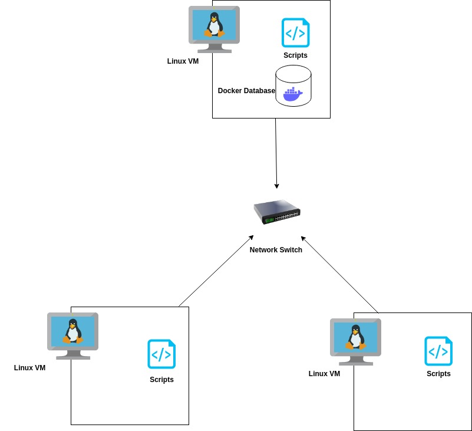

# Linux Cluster Monitoring Agent
This project is under development. Since this project follows the GitFlow, the final work will be merged to the master branch after Team Code Team.

# Introduction
This project is meant to simulate a Linux cluster monitoring agent for resources by retrieving
information about the users' computer via crontab-enabled commands and stores them 
within a PostgreSQL database, the data is then displayed by making various queries to 
the host_agent database. The users of this project is anyone attached within the desired
Linux cluster, the user just needs to ensure they can communicate internally with the other Linux machines
through the use of IPv4 addresses and a network switch.
This project was made using bash, Docker, git, IntelliJ, crontab and SQL.

# Quick Start
- Start a psql instance using psql_docker.sh
```bash
./scripts/psql_docker.sh start
```
- Create tables using ddl.sql
```bash
psql -h localhost -U postgres -d host_agent -f sql/ddl.sql
```
- Insert hardware specs data into the DB using host_info.sh
```bash
./scripts/host_info.sh psql_host psql_port db_name psql_user psql_password
```
- Insert hardware usage data into the DB using host_usage.sh
```bash
bash scripts/host_usage.sh psql_host psql_port db_name psql_user psql_password
```
- Crontab setup
```bash
* * * * * bash /home/centos/dev/jarvis_data_eng_Marissa/linux_sql/scripts/host_usage.sh localhost 5432 host_agent postgres password > /tmp/host_usage.log
```

# Implemenation
This project was implemented by the use of PostgreSQL, Docker, Intellij IDE, Linux command line, various bash scripts and SQL queries.
PostgreSQL was created in a Docker container using the Postgres-9.6-Alpine retrieved from Docker Hub.
Bash commands were used throughout .sh scripts to retrieve information about the system to be stored in the appropriate table, such as using the Linux
commands lscpu, egrep, vmstat, awk, and more. Regex is used to remove additional unneeded characters from the commands to ensure that the 
value gathered from the command matches the datatype of the field within the database. 
IntelliJ was used as the IDE for the development of this project.
Within the project, the many scripts have different purposes. For more details on specific scripts, refer to the Scripts section.

## Architecture
This diagram represents a Linux cluster with three Linux hosts, a database, and the scripts contained inside each Linux VM instance. The cluster
communicates through internal IPv4 addresses since they are connected internally to each other through the use of a switch. The script runs on each of the Linux
VMs and information is sent over the switch and stored into the Docker-contained database. The host_info script only runs once to obtain information
about the host whereas the host_usage script will run every minute based on the crontab setup.


## Scripts
Shell script description and usage (use markdown code block for script usage)
- **psql_docker.sh**\
  This shell script is used to start/stop or create the psql container as specified by the user.
  The script ensures that the correct amount of arguments have been given to the function and that 
  the user has selected an appropriate option for the psql container based on its status. For example, 
  the psql container cannot be started if it does not yet exist.\
**Script Usage**\
  [db_username]: This is an optional parameter as indicated by the square brackets. A username for the database is only required when creating a docker instance.\
  [db_password]: represents the password for the database. Only required with the create command.
  ```bash
  # Script usage format
  ./scripts/psql_docker.sh start|stop|create [db_username] [db_password]
  
  # Example usage
  ./scripts/psql_docker.sh create "postgres" "password"
  ./scripts/psql_docker.sh start
  ./scripts/psql_docker.sh stop
  ```
- **host_info.sh**\
  The host info shell script is used to gather information about the host through bash commands including 
  the hostname, number of CPUs, CPU architecture, CPU model, CPU MHz, L2 cache, total memory, and timestamp. The process of this 
  script is to parse the command line arguments and save their values into corresponding local variables to be used 
  within the scope of the bash script. Bash scripts are then used to retrieve and parse hardware information to 
  place within variables. The variables are used to construct a INSERT statement to place the data into the Postgres database.\
**Script Usage**:\
  psql_host: represents the name of the host.\
  psql_port: represents the port of Postgres instance.\
  db_name: represents the database name. \
  psql_user: represents the username of the Postgres instance.\
  psql_password: represents the password to the corresponding PSQL user.
  ```bash
  # Script usage format
  ./scripts/host_info.sh psql_host psql_port db_name psql_user psql_password
  
  # Example script usage
  ./scripts/host_info.sh "localhost" 5432 "host_agent" "postgres" "password"
  ```
   
- **host_usage.sh**\
  The host usage script is used to hold resource usage information about all unique hosts connected to the cluster.
The host usage script collects usage information including timestamp, memory free in MB, percentage of CPU idle, percentage
of CPU kernel usage, number of disk I/O, and the amount of disk available in MB. The purpose of this script is to retrieve 
all required usage information through bash scripts and store them in local variables.\
**Script Usage**\
  Refer host_info.sh for parameter information under the Script Usage section.
  ```bash
  # Script usage format
  bash scripts/host_usage.sh psql_host psql_port db_name psql_user psql_password
  
  # Example script usage
  bash scripts/host_usage.sh "localhost" 5432 "host_agent" "postgres" "password"
  ```
- **crontab**\
Crontab is used to automate the collection of host usage information through the use of the host_usage.sh script. In this project,
Crontab is to run every minute and insert the information into the PostgreSQL database as described in the host_usage.sh description.
\
**Script Usage**
  ```bash
  crontab -e
  
  # Paste command into crontab
  * * * * * bash /home/centos/dev/jarvis_data_eng_Marissa/linux_sql/scripts/host_usage.sh localhost 5432 host_agent postgres password > /tmp/host_usage.log
  ```
- **queries.sql**\
The queries SQL file is used to calculate the average use of memory of each host within five minute intervals and to also detect any host failures.
Since crontab is meant to collect host resource usage information each minute, the SQL query will check if there's any five minute
interval with less than 3 data points to indicate a possible host failure. \
**Script Usage**
  ```bash
  psql -h localhost -U postgres -d host_agent -f sql/queries.sql
  ```


## Database Modeling
This section explains the purpose and schema of the tables created within the Postgres database.
- `host_info`\
The table below explains all fields within the host_info table and the description of the column. Host_info is used to store
information about the corresponding host. All fields within the host_info table are required and therefore cannot be left as NULL. 

| Field | Data Type | Description |
| --- | --- | --- |
| id | SERIAL | Represents the primary key identifier corresponding to the host. It is assigned the PRIMARY KEY constraint on table creation.|
| hostname | VARCHAR | Represents the fully qualified hostname. It must be UNIQUE as defined within the table declaration. |
| cpu_number | INT | Represents the number of CPUs. |
| cpu_architecture | VARCHAR | Represents the architecture of the CPU. Example: x86_64|
| cpu_model | VARCHAR | Represents the make model of the CPU. Example: Intel(R) Xeon(R) CPU @ 2.30GHz|
| cpu_mhz | FLOAT(3) | Represents the MHz of the CPU.|
| L2_cache | INT | Represents the amount of L2 cache in kilobytes (KB).|
| total_mem | INT | Represents the amount of total memory in kilobytes (KB).|
| timestamp| TIMESTAMP | Represents the current timestamp in UTC timezone format. |
- `host_usage`\
This table explains all fields defined within the host_usage table and what they represent. Host_usage is used
to hold host resource usage information. It also outlines the datatype and any additional constraints assigned to
the column. All fields within the host_usage table are required and therefore cannot be NULL.

| Field | Data Type | Description |
| --- | --- | --- |
| timestamp | TIMESTAMP | Represents the current timestamp in UTC timezone format. |
| host_id | SERIAL | Represents the id of the host referenced in the host_info table. This field is assigned a FOREIGN KEY constraint.|
| memory_free | INT | Represents the memory free in megabytes (MB).|
| cpu_idle | DECIMAL | Represents the percentage of CPU idle. CHECK constraint is used to ensure percentage is between 0 and 100.|
| cpu_kernel | DECIMAL | Represents the percentage of CPU kernel. CHECK constraint is used to ensure the percentage is between 0 and 100.|
| disk_io | INT | Represents the number of disk I/O.|
| disk_available | INT | Represents the amount of disk available in megabytes (MB) of the root directory.|
# Test
The tests were done manually since it is just a minimum viable product to prove the concepts of gathering information
and storing it within the Docker-contained database. It was also tested on an individual machine rather than a cluster, but
all sequential connects should work if the setup and necessary components are also present.\
All SQL-related scripts were tested by ensuring that the tables were successfully created using **\dt** within the postgres
command line to verify that host_info and host_usage tables were created within the host_agent database. All INSERTs into the database
were verified by using SELECT commands from the appropriate database. The result is to see the existing records printed out from the table to verify an INSERT command
has been successful.

# Deployment
The version control for this project's source code is done using GitHub. Crontab is used to automatically insert records 
into the host_usage table through the use of invoking the host_usage.sh script every minute to retrieve the host resource usage data.
Docker is used to hold the database container created from the Postgres 9.6-Alpine image.

# Improvements
Write at least three things you want to improve
- More data validation regarding the database
- Better error-handling
- Fix cluster diagram to better convey flow of data

